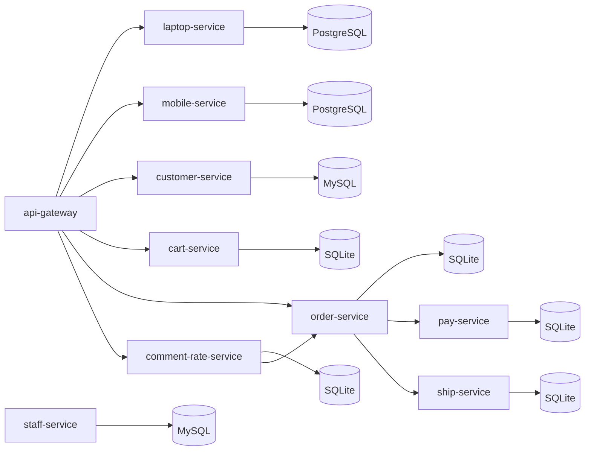

# Project Service Architecture

## Overview

## Service Boundaries

- `laptop-service`: CRUD san pham laptop.
- `mobile-service`: CRUD san pham mobile.
- `staff-service`: quan ly danh sach nhan su (staff).
- `customer-service`: quan ly thong tin khach hang.
- `cart-service`: quan ly gio hang va cart items.
- `order-service`: tao don hang va dieu phoi reserve thanh toan/van chuyen.
- `pay-service`: reserve/cancel thanh toan.
- `ship-service`: reserve/cancel van chuyen.
- `comment-rate-service`: danh gia san pham, co kiem tra da mua qua order-service.

## Data Stores

- `laptop-service` su dung PostgreSQL (`laptop-db`).
- `mobile-service` su dung PostgreSQL (`mobile-db`).
- `staff-service` su dung MySQL (`staff-db`).
- `customer-service` su dung MySQL (`customer-db`).
- `cart-service`, `order-service`, `pay-service`, `ship-service`, `comment-rate-service` su dung SQLite noi bo.

## Runtime Ports

- `api-gateway`: `8000`
- `laptop-service`: `8101`
- `mobile-service`: `8102`
- `staff-service`: `8103`
- `customer-service`: `8104`
- `cart-service`: `8201`
- `comment-rate-service`: `8202`
- `pay-service`: `8203`
- `ship-service`: `8204`
- `order-service`: `8205`

## Health Endpoints

- `GET /health/` tren moi service.
